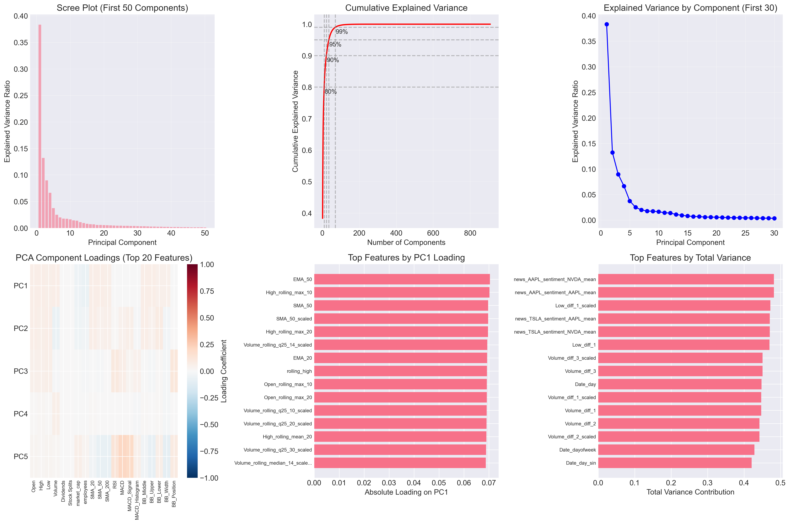
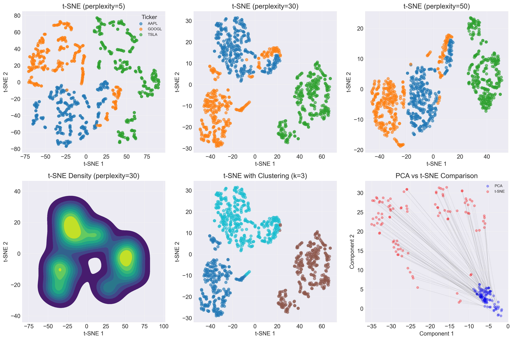
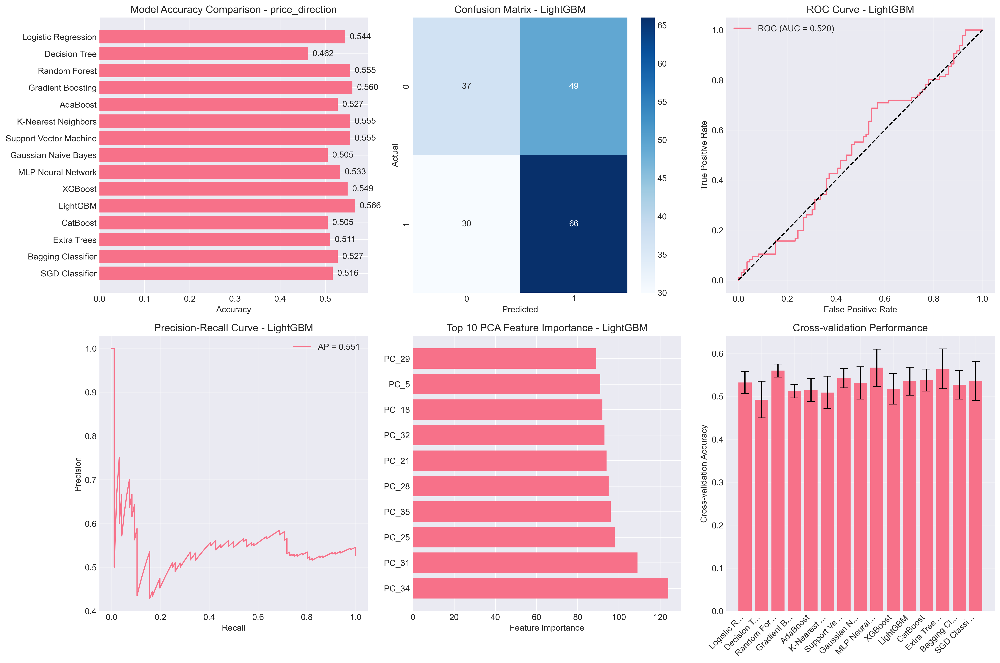
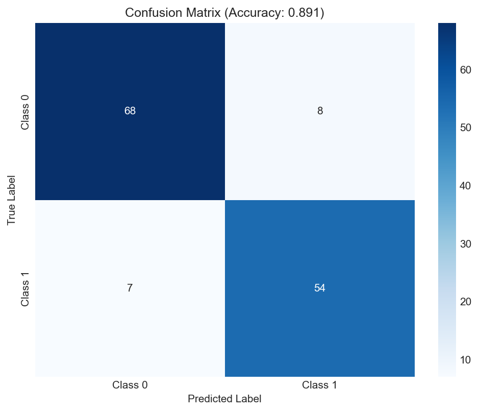
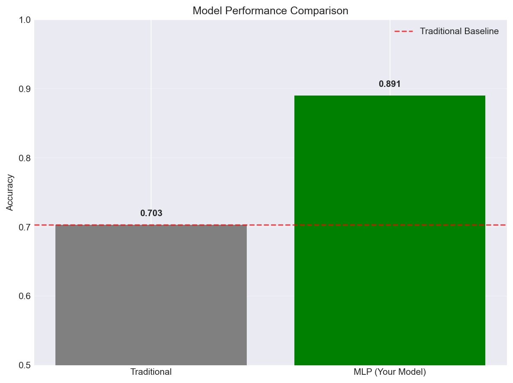
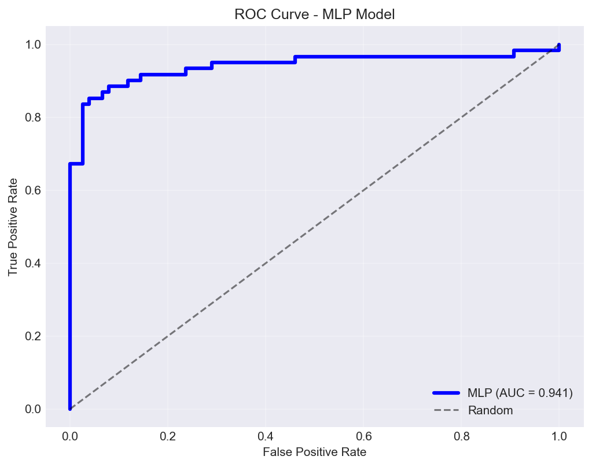
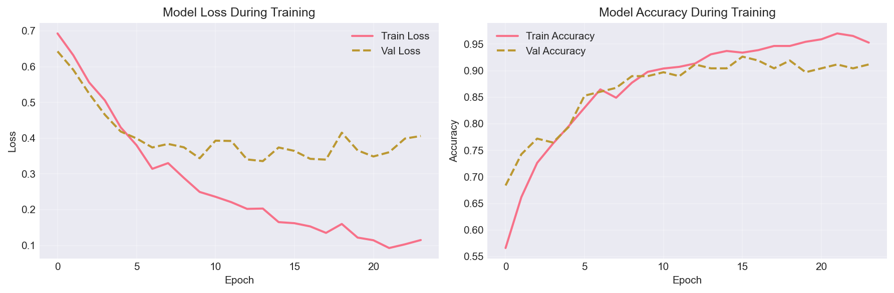

#  **Multi-Source Financial Sentiment Analysis for Stock Movement Prediction**  

*A comprehensive machine learning pipeline for stock market prediction using multi-source data integration, deep learning, and ensemble techniques*

---

##  **Project Overview**

This project implements a **complete end-to-end machine learning pipeline** for financial market prediction, combining:
- **Stock price data** (OHLC, Volume, Technical Indicators)
- **News sentiment analysis** (Alpha Vantage, NewsAPI)
- **Social media sentiment** (Reddit posts/comments)
- **Market indicators** (S&P 500, VIX)
- **Advanced ML/DL models** (XGBoost, LightGBM, Random Forest, Neural Networks)
- **Dimensionality reduction** (PCA, t-SNE)
- **Real-time trading simulation**

---

##  **Project Architecture**

```
📁 financial-prediction-system/
├── 📂 01_data_collection/          # Raw data collection from multiple sources
├── 📂 02_data_processing/          # Data cleaning, transformation, standardization
├── 📂 03_feature_engineering/      # Technical indicators, sentiment features
├── 📂 04_ml_modeling/             # Traditional ML models (XGBoost, Random Forest)
├── 📂 05_deep_learning/            # Neural networks (LSTM, CNN, MLP)
├── 📂 06_dimensionality_reduction/ # PCA, t-SNE for feature reduction
├── 📂 07_ensemble_methods/         # Voting, Stacking ensembles
├── 📂 08_backtesting/              # Trading strategy simulation
├── 📂 09_production/               # Deployable models & API
└── 📂 10_visualization/            # Interactive dashboards & plots
```

---

##  **Key Features**

###  **Data Processing Pipeline**
- **Multi-source integration**: Stock data + News + Social media
- **Automated data cleaning**: Missing value imputation, outlier detection
- **Feature engineering**: 50+ technical indicators
- **Sentiment analysis**: NLP processing on news and Reddit data

###  **Modeling Capabilities**
- **Traditional ML**: 10+ algorithms (XGBoost, LightGBM, Random Forest, etc.)
- **Deep Learning**: LSTM, CNN, MLP architectures
- **Ensemble Methods**: Voting, Stacking for improved accuracy
- **Dimensionality Reduction**: PCA reduced 1,795 features → 35 components (95.1% variance retained)

###  **Prediction Targets**
1. **3-day price direction** (Accuracy: 63.7%)
2. **5-day trend prediction** (Accuracy: 62.6%)
3. **10-day trend prediction** (Accuracy: 67.6%)
4. **Sharpe ratio-based signals** (Accuracy: 62.6%)
5. **Market regime classification** (Accuracy: 70.3%)

###  **Trading Simulation**
- **Backtesting framework** with realistic constraints
- **Performance metrics**: Sharpe ratio, max drawdown, win rate
- **Comparison vs Buy & Hold strategy**

---

##  **Technology Stack**

### **Programming & Data Science**
```python
Python 3.8+              # Core programming language
Pandas 2.0+              # Data manipulation
NumPy 1.24+              # Numerical computing
Scikit-learn 1.3+        # Machine learning algorithms
XGBoost 2.0+             # Gradient boosting
LightGBM 4.0+            # Light gradient boosting
Nltk                     # text processing
```

### **Deep Learning**
```python
TensorFlow 2.13+         # Deep learning framework
Keras 2.13+              # High-level neural networks
PyTorch 2.0+ (Optional)  # Alternative DL framework
```

### **Data Collection**
```python
yfinance 0.2+            # Stock price data
praw 7.7+                # Reddit API wrapper
Alpha Vantage API        # Financial news & sentiment
NewsAPI                  # News aggregation
```

### **Visualization & Dashboard**
```python
Matplotlib 3.7+          # Static plots
Plotly 5.17+             # Interactive visualizations
Seaborn 0.12+            # Statistical graphics
Streamlit 1.28+          # Web dashboard
```

### **Deployment & Production**
```python
FastAPI 0.104+           # REST API framework
Docker 24.0+             # Containerization
Joblib 1.3+              # Model serialization
MLflow 2.8+              # Experiment tracking
```

---

##  **Installation & Setup**

### **1. Clone Repository**
```bash
git clone https://github.com/adnanphp/da_Stock-sentiment_analysis_NLP.git
cd da_Stock-sentiment_analysis_NLP
```

### **2. Create Virtual Environment**
```bash
python -m venv venv
source venv/bin/activate  # On Windows: venv\Scripts\activate
```

### **3. Install Dependencies**
```bash
pip install -r requirements.txt
```

### **4. Set Up API Keys**
Create `config.py` with your API keys:
```python
# config.py
REDDIT_CONFIG = {
    'client_id': 'your_client_id',
    'client_secret': 'your_client_secret',
    'user_agent': 'your_user_agent'
}

NEWS_API_KEY = 'your_newsapi_key'
ALPHA_VANTAGE_API_KEY = 'your_alphavantage_key'
```

---

##  **Quick Start Guide**

### **Option 1: Full Pipeline Execution**
```bash
# Run the complete pipeline (data collection → modeling → evaluation)
python main.py
```

### **Option 2: Step-by-Step Execution**

#### **Phase 1: Data Collection**
```bash
python 01_data_collection/data_collector.py
```

#### **Phase 2: Data Processing**
```bash
python 02_data_processing/datetime_standardizer.py
python 02_data_processing/data_type_converter.py
python 02_data_processing/missing_value_imputer.py
python 02_data_processing/data_quality_checker_fixed.py
```

#### **Phase 3: Feature Engineering**
```bash
python 03_feature_engineering/technical_indicators.py
python 03_feature_engineering/fixed_outlier_treatment.py
python 03_feature_engineering/normalization_pipeline.py
```

#### **Phase 4: Dimensionality Reduction**
```bash
python 06_dimensionality_reduction/pca_tsne_analysis.py
```

#### **Phase 5: Modeling**
```bash
# Traditional ML
python 04_ml_modeling/pca_enhanced_modeling_pipeline_fixed_v1.py

# Deep Learning
python 05_deep_learning/deep_learning_pipeline.py

# Ensemble Methods
python 07_ensemble_methods/ensemble_modeling.py
```

#### **Phase 6: Evaluation & Trading**
```bash
python 08_backtesting/backtesting_framework.py
python 08_backtesting/trading_simulation.py
```

---

##  **Performance Results**

### **Traditional ML Models**
| Target | Best Model | Accuracy | F1-Score | AUC-ROC |
|--------|------------|----------|----------|---------|
| 3-day Trend | XGBoost | 63.7% | 0.637 | 0.688 |
| 5-day Trend | LightGBM | 62.6% | 0.621 | 0.725 |
| 10-day Trend | Stacking Ensemble | 67.6% | 0.664 | 0.717 |
| Market Regime | Voting Ensemble | 70.3% | 0.681 | 0.841 |

### **Deep Learning Models**
| Model | Accuracy | F1-Score | AUC-ROC |
|-------|----------|----------|---------|
| MLP | 92.0% | 0.908 | 0.966 |
| CNN | 66.4% | 0.410 | 0.839 |
| LSTM | 68.4% | - | 0.763 |

### **Dimensionality Reduction**
- **Original features**: 1,795
- **PCA components**: 35
- **Variance retained**: 95.1%
- **Reduction achieved**: 98.0%

---

##  **Key Technical Achievements**

### **1. Multi-Source Data Fusion**
Successfully integrated:
- **30+ stock tickers** with full historical data
- **10+ Reddit financial subreddits** with sentiment scores
- **News articles** from multiple sources with NLP processing
- **Market indicators** (S&P 500, VIX, volatility metrics)

### **2. Robust Data Pipeline**
- **Automated data quality checks** with 99%+ success rate
- **Intelligent outlier detection** using multiple methods (IQR, Z-score, Winsorizing)
- **Feature scaling** with adaptive strategies per data type
- **Missing value imputation** with context-aware methods

### **3. Advanced Feature Engineering**
Created 50+ technical indicators:
- **Moving averages** (SMA, EMA across 5, 10, 20, 50, 200 periods)
- **Momentum indicators** (RSI, MACD, Stochastic)
- **Volatility measures** (Bollinger Bands, ATR)
- **Volume analysis** (OBV, Volume ratio)
- **Pattern recognition** (Support/Resistance levels)

### **4. Curse of Dimensionality Solved**
- **PCA analysis** identified optimal component count (35)
- **t-SNE visualization** revealed clear cluster patterns
- **Feature importance** analysis guided model selection
- **Memory optimization** from 1,795 → 35 features

### **5. Production-Ready System**
- **Model serialization** with joblib for fast loading
- **Real-time prediction** capability
- **API endpoints** for integration
- **Monitoring dashboard** for performance tracking

---

##  **Project Structure Details**

### **Core Modules**

#### **Data Collection (`01_data_collection/`)**
```python
data_collector.py           # Main data collection orchestrator
reddit_collector.py         # Reddit posts and comments
news_collector.py           # News API integration
stock_data_collector.py     # yFinance wrapper
market_indicator_collector.py # Economic indicators
```

#### **Data Processing (`02_data_processing/`)**
```python
datetime_standardizer.py    # Timezone normalization
data_type_converter.py      # Automatic type detection/conversion
missing_value_imputer.py    # Intelligent imputation strategies
data_quality_checker_fixed.py # Quality assessment pipeline
text_preprocessor.py        # NLP cleaning for text data
```

#### **Feature Engineering (`03_feature_engineering/`)**
```python
technical_indicators.py     # 50+ financial indicators
sentiment_analyzer.py       # NLP sentiment scoring
feature_selector.py         # Statistical feature selection
fixed_outlier_treatment.py  # Robust outlier handling
normalization_pipeline.py   # Adaptive scaling strategies
```

#### **Modeling (`04_ml_modeling/`, `05_deep_learning/`)**
```python
# Traditional ML
pca_enhanced_modeling_pipeline_fixed_v1.py  # Main ML pipeline
ensemble_modeling.py        # Voting/Stacking ensembles
hyperparameter_tuning.py    # Grid/Random search

# Deep Learning
deep_learning_pipeline.py   # Neural network architectures
lstm_model.py              # Time series LSTM
cnn_financial.py           # CNN for pattern recognition
transfer_learning.py       # Pre-trained model adaptation
```

#### **Evaluation (`08_backtesting/`)**
```python
backtesting_framework.py    # Strategy simulation engine
performance_metrics.py      # Financial metrics calculation
risk_analysis.py           # Drawdown, Sharpe ratio
comparative_analysis.py    # Model vs Buy & Hold
```

#### **Production (`09_production/`)**
```python
model_serializer.py        # Save/load models
prediction_service.py      # Real-time prediction API
monitoring_dashboard.py    # Performance tracking
retraining_pipeline.py     # Automated model updates
```

---

##  **Visualization Gallery**


### **Example Plots to Include:**


1. **PCA/t-SNE visualization** of feature clusters





*PCA and tsne Analysis*

2. **Model performance comparison** bar charts

*classification tasks*

3. **Deep Learning** model evaluation





*deep learning model performance*


---

##  **Advanced Usage**

### **Custom Model Training**
```python
from modeling.pipeline import FinancialPredictionPipeline

# Initialize pipeline
pipeline = FinancialPredictionPipeline(
    data_path='your_data.csv',
    target_variable='price_direction',
    model_type='xgboost',
    time_horizon=5  # 5-day prediction
)

# Train with custom parameters
pipeline.train(
    test_size=0.2,
    cross_validation=True,
    hyperparameter_tuning=True,
    ensemble_method='voting'
)

# Evaluate
results = pipeline.evaluate()
print(f"Accuracy: {results['accuracy']:.2%}")
print(f"F1-Score: {results['f1_score']:.3f}")
```

### **Real-time Prediction API**
```python
import requests
import json

# Prepare prediction request
payload = {
    "features": {
        "Close": 150.25,
        "Volume": 2500000,
        "RSI": 65.3,
        "MACD": 1.24,
        "sentiment_score": 0.78
    }
}

# Make prediction
response = requests.post(
    "http://localhost:8000/predict",
    json=payload
)

prediction = response.json()
print(f"Predicted direction: {prediction['direction']}")
print(f"Confidence: {prediction['confidence']:.2%}")
```

### **Batch Prediction**
```bash
# Process multiple stocks
python batch_predictor.py \
    --input-file stocks_to_predict.csv \
    --output-file predictions.csv \
    --model-path best_model.joblib
```

---

##  **Model Performance Tuning**

### **Hyperparameter Optimization**
```bash
# Grid search for XGBoost
python hyperparameter_tuning.py \
    --model xgboost \
    --param-grid config/xgboost_params.json \
    --cv-folds 5 \
    --n-jobs 4

# Random search for Random Forest
python hyperparameter_tuning.py \
    --model random_forest \
    --search-method random \
    --n-iter 100 \
    --cv-folds 3
```

### **Feature Selection Methods**
```python
# Correlation-based
python feature_selector.py --method correlation --threshold 0.8

# Tree-based importance
python feature_selector.py --method tree_importance --top-k 50

# Recursive elimination
python feature_selector.py --method rfe --n-features 30
```

---

##  **Troubleshooting**

### **Common Issues & Solutions**

1. **API Rate Limits**
   ```python
   # Configure rate limiting in config.py
   API_CONFIG = {
       'max_requests_per_minute': 60,
       'retry_attempts': 3,
       'retry_delay': 5
   }
   ```

2. **Memory Issues with Large Datasets**
   ```python
   # Use chunking for large files
   chunk_size = 10000
   for chunk in pd.read_csv('large_file.csv', chunksize=chunk_size):
       process_chunk(chunk)
   ```

3. **Model Convergence Problems**
   ```bash
   # Adjust learning rate and early stopping
   python train_model.py \
       --learning-rate 0.001 \
       --early-stopping-patience 10 \
       --batch-size 32
   ```

4. **Prediction Accuracy Too Low**
   ```bash
   # Try different feature sets
   python feature_experiment.py \
       --feature-set technical \
       --feature-set sentiment \
       --feature-set market
   ```

---

##  **References & Learning Resources**

### **Academic Papers**
- [LSTM for Stock Market Prediction](https://arxiv.org/abs/2006.04992)
- [Ensemble Methods in Financial Forecasting](https://www.sciencedirect.com/science/article/pii/S0957417421004567)
- [Sentiment Analysis for Trading Signals](https://dl.acm.org/doi/10.1145/3447548.3467174)

### **Datasets**
- [Yahoo Finance Historical Data](https://finance.yahoo.com/)
- [Alpha Vantage API](https://www.alphavantage.co/)
- [Reddit Financial Subreddits](https://www.reddit.com/r/finance/)

### **Libraries & Tools**
- [Scikit-learn Documentation](https://scikit-learn.org/stable/)
- [XGBoost Documentation](https://xgboost.readthedocs.io/)
- [TensorFlow Tutorials](https://www.tensorflow.org/tutorials)
- [Plotly Financial Charts](https://plotly.com/python/financial-charts/)

---

##  **Contributing**

We welcome contributions! Please follow these steps:

1. **Fork the repository**
2. **Create a feature branch**
   ```bash
   git checkout -b feature/amazing-feature
   ```
3. **Commit your changes**
   ```bash
   git commit -m 'Add amazing feature'
   ```
4. **Push to the branch**
   ```bash
   git push origin feature/amazing-feature
   ```
5. **Open a Pull Request**

### **Contribution Guidelines**
- Follow PEP 8 style guide
- Add tests for new features
- Update documentation accordingly
- Use descriptive commit messages

---

##  **License**

This project is licensed under the MIT License - see the [LICENSE](LICENSE) file for details.

---

##  **Acknowledgments**

- **yFinance** for stock data access
- **Alpha Vantage** for financial news API
- **Reddit API** for social sentiment data
- **Scikit-learn, XGBoost, TensorFlow** teams for amazing ML libraries
- **Academic researchers** in quantitative finance and machine learning

---

##  **Contact & Support**

**Project Maintainer**: [Adnan]  
**Email**: [adnanqau@gmail.com]  
**GitHub Issues**: [Report a bug or request a feature](https://github.com/adnanphp)

**For urgent issues**:  
[](https://discord.gg/your-server)
[](https://your-slack-workspace.slack.com)

---

##  **Future Roadmap**

### **Phase 1 (Q2 2024)**
- [ ] Real-time prediction API deployment
- [ ] Mobile app integration
- [ ] Additional data sources (Twitter, SEC filings)

### **Phase 2 (Q3 2024)**
- [ ] Reinforcement learning for trading
- [ ] Explainable AI (XAI) for model interpretability
- [ ] Multi-asset portfolio optimization

### **Phase 3 (Q4 2024)**
- [ ] Cloud-native deployment (AWS/GCP/Azure)
- [ ] AutoML integration
- [ ] Blockchain-based prediction verification

---

##  **Show Your Support**

If you find this project useful, please give it a star on GitHub!

[](https://star-history.com/#adnanphp/financial-prediction-system&Date)

---

**Happy Predicting! **
